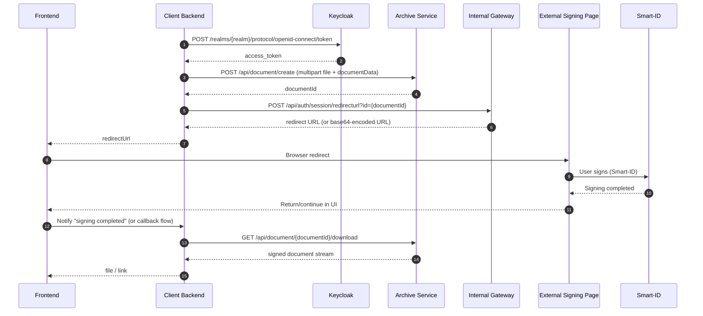

# SignBox Integration Guide

## Scope
This guide follows this exact integration scenario:
1. Get Keycloak token.
2. Upload PDF to Archive service using **document create API with file** (multipart).
3. Get redirect URL from gateway API.
4. Redirect user to signing page (for example Smart-ID flow).
5. After signing is finished, download the final document.

`test1` is only an example username in samples.

## Base URLs
- Auth: `https://<host>/auth`
- Archive service: `https://<host>/signbox-archive-service`
- Internal gateway: `https://<host>/intgateway`

## Environment Variables
Example values below are for testing/demo only. Do not use these hostnames, usernames, or flows as production defaults.

```bash
export AUTH_BASE_URL="https://signbox.trustlynx.com/auth"
export ARCHIVE_BASE_URL="https://signbox.trustlynx.com/signbox-archive-service"
export INTGW_BASE_URL="https://signbox.trustlynx.com/intgateway"

export REALM="TrustLynx"
export CLIENT_ID="signing"
export USERNAME="test1"
export PASSWORD="<set-at-runtime>"
```

## Sequence Diagram


## Step-by-Step API Reference

## 1) Get Keycloak Token
- Method: `POST`
- URL: `{AUTH_BASE_URL}/realms/{REALM}/protocol/openid-connect/token`
- Content-Type: `application/x-www-form-urlencoded`

Request body example:
```text
grant_type=password
client_id=signing
username=test1
password=<runtime-secret>
```

Response example:
```json
{
  "access_token": "<JWT>",
  "expires_in": 300,
  "refresh_token": "<JWT>"
}
```

JavaScript example:
```javascript
async function getToken(cfg) {
  const body = new URLSearchParams({
    grant_type: "password",
    client_id: cfg.clientId,
    username: cfg.username,
    password: cfg.password
  });

  const res = await fetch(
    `${cfg.authBaseUrl}/realms/${cfg.realm}/protocol/openid-connect/token`,
    {
      method: "POST",
      headers: { "Content-Type": "application/x-www-form-urlencoded" },
      body
    }
  );
  if (!res.ok) throw new Error(`Token failed: ${res.status} ${await res.text()}`);
  const json = await res.json();
  return json.access_token;
}
```

## 2) Upload PDF with Document Create API (multipart)
- Method: `POST`
- URL: `{ARCHIVE_BASE_URL}/api/document/create?documentData=<json>`
- Auth: `Authorization: Bearer <access_token>`
- Content-Type: `multipart/form-data`
- Multipart field: `file` (binary PDF)

`documentData` query parameter example object:
```json
{
  "documentFilename": "contract.pdf",
  "objectName": "contract.pdf",
  "documentData": {
    "documentType": "Contract",
    "caseId": "CASE-2026-001"
  }
}
```

Response example:
```json
{
  "id": "545963a4-3dc5-46b1-b64a-f2d292f9f37e",
  "externalid": "0fb9a0ae-0f83-4c2b-8b74-d87643396b57",
  "archiveName": "FS-MAIN"
}
```

JavaScript example:
```javascript
import fs from "node:fs/promises";

async function uploadPdf(cfg, token, filePath) {
  const bytes = await fs.readFile(filePath);
  const form = new FormData();
  form.append("file", new Blob([bytes], { type: "application/pdf" }), "contract.pdf");

  const docData = {
    documentFilename: "contract.pdf",
    objectName: "contract.pdf",
    documentData: {
      documentType: "Contract",
      caseId: "CASE-2026-001"
    }
  };

  const url =
    `${cfg.archiveBaseUrl}/api/document/create?documentData=` +
    encodeURIComponent(JSON.stringify(docData));

  const res = await fetch(url, {
    method: "POST",
    headers: { Authorization: `Bearer ${token}` },
    body: form
  });

  if (!res.ok) throw new Error(`Upload failed: ${res.status} ${await res.text()}`);
  const json = await res.json();
  if (!json.id) throw new Error("Upload response missing document id");
  return json.id;
}
```

## 3) Get Redirect URL
- Method: `POST`
- URL: `{INTGW_BASE_URL}/api/auth/session/redirecturl?id={documentId}`
- Auth: `Authorization: Bearer <access_token>`
- Content-Type: `application/json`
- Body: `{}` (or object required by your deployment profile)

Response:
- API may return plain URL or base64-encoded URL string.

JavaScript example:
```javascript
function decodeIfBase64(value) {
  try {
    const decoded = Buffer.from(value, "base64").toString("utf8");
    return decoded.startsWith("http://") || decoded.startsWith("https://")
      ? decoded
      : value;
  } catch {
    return value;
  }
}

async function getRedirectUrl(cfg, token, documentId) {
  const res = await fetch(
    `${cfg.intgwBaseUrl}/api/auth/session/redirecturl?id=${encodeURIComponent(documentId)}`,
    {
      method: "POST",
      headers: {
        Authorization: `Bearer ${token}`,
        "Content-Type": "application/json"
      },
      body: "{}"
    }
  );

  if (!res.ok) throw new Error(`Redirect URL failed: ${res.status} ${await res.text()}`);
  const raw = await res.text();
  return decodeIfBase64(raw.replace(/^"|"$/g, ""));
}
```

## 4) Redirect User and Execute Signing
Backend returns `redirectUrl` to frontend.

Frontend example:
```javascript
window.location.href = redirectUrl;
```

On that page user performs signing (for example Smart-ID).

## 5) Download Signed Document
- Method: `GET`
- URL: `{ARCHIVE_BASE_URL}/api/document/{documentId}/download`
- Auth: `Authorization: Bearer <access_token>`
- Response: binary file stream

JavaScript example:
```javascript
import fs from "node:fs/promises";

async function downloadSigned(cfg, token, documentId) {
  const res = await fetch(
    `${cfg.archiveBaseUrl}/api/document/${encodeURIComponent(documentId)}/download`,
    { headers: { Authorization: `Bearer ${token}` } }
  );

  if (!res.ok) throw new Error(`Download failed: ${res.status} ${await res.text()}`);
  const bytes = Buffer.from(await res.arrayBuffer());
  const path = `signed-${documentId}.pdf`;
  await fs.writeFile(path, bytes);
  return path;
}
```

## Minimal Orchestrator Example (Node.js)
```javascript
// file: signbox-integration.mjs
const cfg = {
  authBaseUrl: process.env.AUTH_BASE_URL,
  archiveBaseUrl: process.env.ARCHIVE_BASE_URL,
  intgwBaseUrl: process.env.INTGW_BASE_URL,
  realm: process.env.REALM,
  clientId: process.env.CLIENT_ID,
  username: process.env.USERNAME, // example: test1
  password: process.env.PASSWORD
};

const token = await getToken(cfg);
const documentId = await uploadPdf(cfg, token, "./input.pdf");
const redirectUrl = await getRedirectUrl(cfg, token, documentId);
console.log({ documentId, redirectUrl });

// After user signs through redirected page, call download:
// const savedPath = await downloadSigned(cfg, token, documentId);
```

## Known Integration Gaps
- `documentType` must exist in backend mapping, otherwise create/compose flows fail.
- Redirect endpoint returns string payload; some deployments return base64-formatted string.
- For production orchestration, add callback/status checkpoint before final download (depends on your portal flow).

## Troubleshooting
- `401/403`: token or role issue.
- `400/500` on create: invalid `documentData` or missing mapping.
- redirect `500`: verify id and deployment-specific flow requirements.
- document not signed yet at download time: wait for signing completion callback/event.
