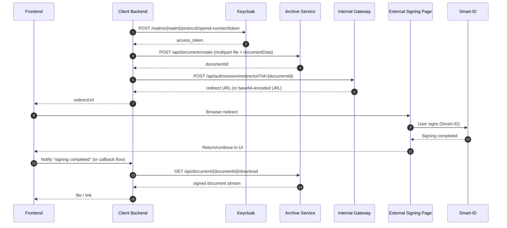

# SignBox Integration Guide

## Scope
This guide follows this exact integration scenario:
1. Get Keycloak token.
2. Upload PDF to Archive service using **document create API with file** (multipart).
3. Get redirect URL from gateway API.
4. Redirect user to signing page (for example Smart-ID flow).
5. After signing is finished, download the final document.

`test1` is only an example username in samples.

## Base URLs
- Auth: `https://<host>/auth`
- Archive service: `https://<host>/signbox-archive-service`
- Internal gateway: `https://<host>/intgateway`

## Environment Variables
Example values below are for testing/demo only. Do not use these hostnames, usernames, or flows as production defaults.

```bash
export AUTH_BASE_URL="https://signbox.trustlynx.com/auth"
export ARCHIVE_BASE_URL="https://signbox.trustlynx.com/signbox-archive-service"
export INTGW_BASE_URL="https://signbox.trustlynx.com/intgateway"

export REALM="TrustLynx"
export CLIENT_ID="signing"
export USERNAME="test1"
export PASSWORD="<set-at-runtime>"
```

## Sequence Diagram

```mermaid
sequenceDiagram
  autonumber
  participant FE as Frontend
  participant BE as Client Backend
  participant KC as Keycloak
  participant AR as Archive Service
  participant GW as Internal Gateway
  participant EP as External Signing Page
  participant SID as Smart-ID

  BE->>KC: POST /realms/{realm}/protocol/openid-connect/token
  KC-->>BE: access_token

  BE->>AR: POST /api/document/create (multipart file + documentData)
  AR-->>BE: documentId

  BE->>GW: POST /api/auth/session/redirecturl?id={documentId}
  GW-->>BE: redirect URL (or base64-encoded URL)
  BE-->>FE: redirectUrl

  FE->>EP: Browser redirect
  EP->>SID: User signs (Smart-ID)
  SID-->>EP: Signing completed
  EP-->>FE: Return/continue in UI

  FE->>BE: Notify "signing completed" (or callback flow)
  BE->>AR: GET /api/document/{documentId}/download
  AR-->>BE: signed document stream
  BE-->>FE: file / link
```

## Step-by-Step API Reference

## 1) Get Keycloak Token
- Method: `POST`
- URL: `{AUTH_BASE_URL}/realms/{REALM}/protocol/openid-connect/token`
- Content-Type: `application/x-www-form-urlencoded`

Request body example:
```text
grant_type=password
client_id=signing
username=test1
password=<runtime-secret>
```

Response example:
```json
{
  "access_token": "<JWT>",
  "expires_in": 300,
  "refresh_token": "<JWT>"
}
```

JavaScript example:
```javascript
async function getToken(cfg) {
  const body = new URLSearchParams({
    grant_type: "password",
    client_id: cfg.clientId,
    username: cfg.username,
    password: cfg.password
  });

  const res = await fetch(
    `${cfg.authBaseUrl}/realms/${cfg.realm}/protocol/openid-connect/token`,
    {
      method: "POST",
      headers: { "Content-Type": "application/x-www-form-urlencoded" },
      body
    }
  );
  if (!res.ok) throw new Error(`Token failed: ${res.status} ${await res.text()}`);
  const json = await res.json();
  return json.access_token;
}
```

## 2) Upload PDF with Document Create API (multipart)
- Method: `POST`
- URL: `{ARCHIVE_BASE_URL}/api/document/create?documentData=<json>`
- Auth: `Authorization: Bearer <access_token>`
- Content-Type: `multipart/form-data`
- Multipart field: `file` (binary PDF)

`documentData` query parameter example object:
```json
{
  "documentFilename": "contract.pdf",
  "objectName": "contract.pdf",
  "documentData": {
    "documentType": "Contract",
    "caseId": "CASE-2026-001"
  }
}
```

Response example:
```json
{
  "id": "545963a4-3dc5-46b1-b64a-f2d292f9f37e",
  "externalid": "0fb9a0ae-0f83-4c2b-8b74-d87643396b57",
  "archiveName": "FS-MAIN"
}
```

JavaScript example:
```javascript
import fs from "node:fs/promises";

async function uploadPdf(cfg, token, filePath) {
  const bytes = await fs.readFile(filePath);
  const form = new FormData();
  form.append("file", new Blob([bytes], { type: "application/pdf" }), "contract.pdf");

  const docData = {
    documentFilename: "contract.pdf",
    objectName: "contract.pdf",
    documentData: {
      documentType: "Contract",
      caseId: "CASE-2026-001"
    }
  };

  const url =
    `${cfg.archiveBaseUrl}/api/document/create?documentData=` +
    encodeURIComponent(JSON.stringify(docData));

  const res = await fetch(url, {
    method: "POST",
    headers: { Authorization: `Bearer ${token}` },
    body: form
  });

  if (!res.ok) throw new Error(`Upload failed: ${res.status} ${await res.text()}`);
  const json = await res.json();
  if (!json.id) throw new Error("Upload response missing document id");
  return json.id;
}
```

## 3) Get Redirect URL
- Method: `POST`
- URL: `{INTGW_BASE_URL}/api/auth/session/redirecturl?id={documentId}`
- Auth: `Authorization: Bearer <access_token>`
- Content-Type: `application/json`
- Body: `{}` (or object required by your deployment profile)

Response:
- API may return plain URL or base64-encoded URL string.

JavaScript example:
```javascript
function decodeIfBase64(value) {
  try {
    const decoded = Buffer.from(value, "base64").toString("utf8");
    return decoded.startsWith("http://") || decoded.startsWith("https://")
      ? decoded
      : value;
  } catch {
    return value;
  }
}

async function getRedirectUrl(cfg, token, documentId) {
  const res = await fetch(
    `${cfg.intgwBaseUrl}/api/auth/session/redirecturl?id=${encodeURIComponent(documentId)}`,
    {
      method: "POST",
      headers: {
        Authorization: `Bearer ${token}`,
        "Content-Type": "application/json"
      },
      body: "{}"
    }
  );

  if (!res.ok) throw new Error(`Redirect URL failed: ${res.status} ${await res.text()}`);
  const raw = await res.text();
  return decodeIfBase64(raw.replace(/^"|"$/g, ""));
}
```

## 4) Redirect User and Execute Signing
Backend returns `redirectUrl` to frontend.

Frontend example:
```javascript
window.location.href = redirectUrl;
```

On that page user performs signing (for example Smart-ID).

## 5) Download Signed Document
- Method: `GET`
- URL: `{ARCHIVE_BASE_URL}/api/document/{documentId}/download`
- Auth: `Authorization: Bearer <access_token>`
- Response: binary file stream

JavaScript example:
```javascript
import fs from "node:fs/promises";

async function downloadSigned(cfg, token, documentId) {
  const res = await fetch(
    `${cfg.archiveBaseUrl}/api/document/${encodeURIComponent(documentId)}/download`,
    { headers: { Authorization: `Bearer ${token}` } }
  );

  if (!res.ok) throw new Error(`Download failed: ${res.status} ${await res.text()}`);
  const bytes = Buffer.from(await res.arrayBuffer());
  const path = `signed-${documentId}.pdf`;
  await fs.writeFile(path, bytes);
  return path;
}
```

## Minimal Orchestrator Example (Node.js)
```javascript
// file: signbox-integration.mjs
const cfg = {
  authBaseUrl: process.env.AUTH_BASE_URL,
  archiveBaseUrl: process.env.ARCHIVE_BASE_URL,
  intgwBaseUrl: process.env.INTGW_BASE_URL,
  realm: process.env.REALM,
  clientId: process.env.CLIENT_ID,
  username: process.env.USERNAME, // example: test1
  password: process.env.PASSWORD
};

const token = await getToken(cfg);
const documentId = await uploadPdf(cfg, token, "./input.pdf");
const redirectUrl = await getRedirectUrl(cfg, token, documentId);
console.log({ documentId, redirectUrl });

// After user signs through redirected page, call download:
// const savedPath = await downloadSigned(cfg, token, documentId);
```

## Notification Configuration

SignBox sends email notifications during the signing process (new task, reminder, completion, cancellation, decline, etc.). Notifications are produced by the **process-and-auditing-service** and are fully configuration-driven — you control **which event types** produce emails, **which roles** receive them, the **subject line**, and the **HTML template** used, per language.

### Where it is configured

| Concern | File | Notes |
| --- | --- | --- |
| Which roles get notified, subjects, templates | `application-notifications.yml` | The notification matrix: event → role → language |
| SMTP relay, sender address, reminder schedule, portal URLs | `application.yml` | Mail transport and reminder timing |
| Email body (Thymeleaf HTML) | `templates/*.html` | One file per email type |

On a standard Docker deployment these live under:

```bash
/opt/trustlynx/signbox-process-and-auditing-service/application-notifications.yml
/opt/trustlynx/signbox-process-and-auditing-service/application.yml
/opt/trustlynx/signbox-process-and-auditing-service/templates/
```

The notifications file is loaded only because the service runs with the `notifications` Spring profile (`SPRING_PROFILES_ACTIVE=notifications`).

### Roles

Every notification is targeted at a process role:

| Role | Who it is |
| --- | --- |
| `initiator` | The user who started the signing process |
| `signer` | A person who must sign |
| `approver` | A person who must approve (no signature) |
| `viewer` | A person who only receives / views the document |
| `administrator` | System admin address, used for `FAILURE` events — set under `notifications.admin.email` |

### Event types

| `type` | When it fires | Roles notified in the default config |
| --- | --- | --- |
| `PROCESS_STARTED` | A new process is created | initiator |
| `TASK_STARTED` | A recipient's task becomes active | signer, approver, viewer |
| `REMINDER` | Reminder job runs for an unfinished task | signer, approver |
| `SIGNER_SIGNED` | A signer signs | *(subjects only, templates blank → no email sent)* |
| `APPROVER_APPROVED` | An approver approves | initiator |
| `SIGNER_DECLINED` | A signer declines | initiator, signer |
| `APPROVER_DECLINED` | An approver declines | initiator |
| `PROCESS_CANCELED` | Initiator cancels the process | initiator, signer, approver, viewer |
| `PROCESS_COMPLETED` | All tasks done, process completed | initiator, signer, viewer |
| `PROCESS_FINISHED` | Signing finished by signers | initiator |
| `FAILURE` | Processing error | administrator |

### How "to which roles it comes or not" works

The matrix is a list of `events`. Each event has a `type` and a list of `roles`. Each role entry has one or more `langs`, and each language carries a `subject` and a `template`:

```yaml
notifications:
  defaultLanguage: en
  admin:
    email: admin@example.com
  events:
    - type: TASK_STARTED
      roles:
        - role: signer
          langs:
            - lang: en
              subject: "New document for electronic signing"
              template: email.html
        - role: approver
          langs:
            - lang: en
              subject: "New document available for approval"
              template: email_approve.html
        - role: viewer
          langs:
            - lang: en
              subject: "New document available for viewing"
              template: viewer.html
```

**The rule is simple:**

- A role **receives** the email when a `template` is set for that event / role / language.
- A role does **not** receive the email when the `template` is empty/blank — even if a `subject` is present. A blank template suppresses sending for that role.

Example — for `SIGNER_DECLINED`, notify the initiator and signer but **not** the approver or viewer:

```yaml
- type: SIGNER_DECLINED
  roles:
    - role: initiator
      langs:
        - lang: en
          subject: "Document signing declined"
          template: email_decline_by_signer.html
    - role: signer
      langs:
        - lang: en
          subject: "Document signing declined"
          template: email_cancel_signer.html
    - role: approver
      langs:
        - lang: en
          subject: "Document signing declined"
          template:          # blank -> approver is NOT notified
    - role: viewer
      langs:
        - lang: en
          subject: "Document signing declined"
          template:          # blank -> viewer is NOT notified
```

To **enable** a role that is currently silent, point its `template` at an existing HTML file in `templates/`. To **disable** a role, clear its `template`.

### Templates

Templates are Thymeleaf HTML files in the `templates/` folder. The mapping used by the default configuration:

| Template | Used for |
| --- | --- |
| `email.html` | TASK_STARTED → signer (new document to sign) |
| `email_approve.html` | TASK_STARTED → approver |
| `viewer.html` | TASK_STARTED → viewer |
| `email_initiator.html` | PROCESS_STARTED → initiator (also FAILURE → administrator) |
| `email_reminder.html` | REMINDER → signer |
| `email_reminder_approver.html` | REMINDER → approver |
| `email_decline_by_signer.html` | SIGNER_DECLINED → initiator |
| `email_cancel_signer.html` | SIGNER_DECLINED → signer |
| `email_decline_approver.html` | APPROVER_DECLINED → initiator |
| `email_approver_approved.html` | APPROVER_APPROVED → initiator |
| `email_cancel_by_initiator.html` | PROCESS_CANCELED → signer / approver / viewer |
| `email_cancel_by_initiator_to_initiator.html` | PROCESS_CANCELED → initiator |
| `email_complete.html` | PROCESS_COMPLETED → signer / viewer |
| `email_complete_initiator.html` | PROCESS_COMPLETED / PROCESS_FINISHED → initiator |

Additional templates ship in the folder (e.g. `email_signer_signed.html`, `email_approver_approved_initiator.html`, `email_cancel.html`) and can be wired into any event by referencing them in `application-notifications.yml`.

Common dynamic values available inside templates (Thymeleaf):

```html
<span th:text="${process.documentName}"></span>    <!-- document name -->
<span th:text="${process.initiatorName}"></span>    <!-- initiator name -->
<span th:text="${process.comment}"></span>          <!-- process comment -->
<span th:text="${signer.commentForSigner}"></span>  <!-- per-recipient comment -->
<span th:text="${#calendars.format(dueDate, 'dd.MM.yyyy HH:mm')}"></span>  <!-- due date -->
```

Per-recipient signing link (do not hardcode a static URL):

```html
<a th:href="@{__${extportalUrl}__/process/{id}(id=${signer.Id})}">Open signing page</a>
```

### Multiple languages

`defaultLanguage` sets the fallback. Each role can list several `langs` entries; SignBox picks the recipient's language and falls back to `defaultLanguage` when no match is found:

```yaml
- role: signer
  langs:
    - lang: en
      subject: "New document for electronic signing"
      template: email.html
    - lang: lv
      subject: "Jauns dokuments elektroniskai parakstīšanai"
      template: email_lv.html
```

### Reminder notifications

`REMINDER` emails are sent for unfinished signer / approver tasks. Timing is **due-date based** and controlled in `application.yml`:

```yaml
dmss:
  jobs:
    reminder:
      schedule: 0 0 11 * * ?      # cron: every day at 11:00
      audit: false
      daysBeforeDueDate: 1, 3, 5  # send reminders 5, 3 and 1 days before the task due date
```

A reminder is sent only if the recipient has not completed the task and the process is still active (not completed or canceled). The process must have a due date for due-date-based reminders to fire.

### SMTP transport

Delivery uses the SMTP relay configured in `application.yml`:

```yaml
spring:
  mail:
    host: <smtp-relay-host>
    port: <smtp-relay-port>
    fromAddress: "\"SignBox\" <noreply@example.com>"
    username: <user>
    password: <secret>
    properties.mail.smtp:
      auth: 'true'
      starttls.enable: 'true'
```

`settings.replyToInitiator: true` routes recipient replies to the process initiator's email address.

### Applying changes

After editing `application-notifications.yml`, `application.yml`, or any template, restart the service:

```bash
cd /opt/trustlynx
docker compose restart signbox-process-and-auditing-service
docker logs --since 2m signbox-process-and-auditing-service   # check for template / parse errors
```

> **Ansible-managed deployments:** edit `resources/process_and_auditing_service/application-notifications.yml.j2` (and the files in `resources/process_and_auditing_service/templates/`) in the delivery repository and re-run the playbook — editing only on the server is overwritten on the next deployment.

Changes apply to **new** notifications only; already-sent emails are unaffected.

## Known Integration Gaps
- `documentType` must exist in backend mapping, otherwise create/compose flows fail.
- Redirect endpoint returns string payload; some deployments return base64-formatted string.
- For production orchestration, add callback/status checkpoint before final download (depends on your portal flow).

## Troubleshooting
- `401/403`: token or role issue.
- `400/500` on create: invalid `documentData` or missing mapping.
- redirect `500`: verify id and deployment-specific flow requirements.
- document not signed yet at download time: wait for signing completion callback/event.
