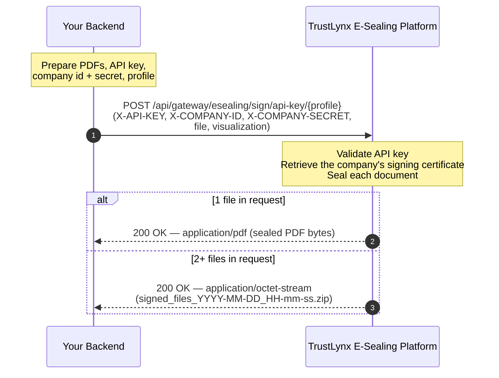

# E-Sealing API Integration Guide (Single and Bulk)

## Scope

This guide describes how to e-seal PDF documents with a company signing certificate through the TrustLynx e-sealing API.

The API is designed for server-to-server use:

- **Single-document** requests return the sealed PDF.
- **Bulk** requests (two or more files in the same call) return a ZIP archive containing the sealed PDFs.

The same endpoint handles both cases — the response format is chosen by how many files are sent in the request.

## How a company gets onboarded (high level)

Before the API can be called, TrustLynx prepares the company account. At a high level the onboarding covers:

1. Issuing a signing certificate in the company's name via the relevant certificate authority.
2. Placing that certificate into TrustLynx's secure key storage so it can be used to e-seal documents on the company's behalf.
3. Provisioning four values that are handed to the integrator:
   - an **API key**,
   - a **company identifier** (UUID),
   - a **company secret**,
   - a **signature profile name**.

Onboarding itself is carried out by TrustLynx and is out of scope for this guide. Once the four values above are in your hands, you can start calling the endpoint described below.

## Base URL and environment variables

```bash
export GATEWAY_BASE_URL="https://<host>"          # e.g. https://esealing.trustlynx.com
export TLX_API_KEY="<issued-to-you>"
export TLX_COMPANY_ID="<your-company-uuid>"
export TLX_COMPANY_SECRET="<your-company-secret>"
export TLX_PROFILE="<your-profile-name>"          # e.g. TrustLynx
```

## Authentication headers

Every request must carry all three headers below.

| Header             | Required | Description                                                          |
|--------------------|----------|----------------------------------------------------------------------|
| `X-API-KEY`        | yes      | API key issued to the company.                                       |
| `X-COMPANY-ID`     | yes      | Company UUID identifying the certificate holder.                     |
| `X-COMPANY-SECRET` | yes      | Company secret that authorises use of the stored signing certificate.|

## Sequence diagram



## Endpoint reference

**`POST {GATEWAY_BASE_URL}/api/gateway/esealing/sign/api-key/{profile}`**

- **Path parameter**
  - `profile` — signature profile name configured for the company (for example `TrustLynx`).
- **Content-Type**: `multipart/form-data`
- **Form fields**
  - `file` (binary, repeatable) — one or more PDFs to e-seal. Send the same field name once per file to submit a batch.
  - `visualization` (string, `"true"` or `"false"`) — whether to render a visual signature block on the sealed PDF.

## Responses

| Case            | HTTP | Content-Type               | Body                                                                                                                                                                              |
|-----------------|------|----------------------------|-----------------------------------------------------------------------------------------------------------------------------------------------------------------------------------|
| Single file     | 200  | `application/pdf`          | Sealed PDF bytes.                                                                                                                                                                 |
| Multiple files  | 200  | `application/octet-stream` | ZIP archive. `Content-Disposition: attachment; filename="signed_files_YYYY-MM-DD_HH-mm-ss.zip"`. Each entry keeps the original filename; duplicates are disambiguated as `name_1.pdf`, `name_2.pdf`, … |

## Error reference

Validation errors are returned as JSON with the following shape:

```json
{
  "code": 404,
  "message": "Wrong company id"
}
```

| HTTP | `code` | `message`                  | Cause                                                                 |
|------|--------|----------------------------|-----------------------------------------------------------------------|
| 400  | —      | `No files provided`        | Request contained no `file` part.                                     |
| 400  | 403    | `Incorrect Api Key Format` | `X-API-KEY` fails format validation.                                  |
| 400  | 403    | `API Key time expired`     | The issued API key is past its validity window.                       |
| 400  | 404    | `Wrong company id`         | `X-COMPANY-ID` does not match a known company.                        |
| 400  | 404    | `Wrong company secret`     | `X-COMPANY-SECRET` does not match the value stored for that company.  |
| 500  | —      | `File signing failed for: <filename>` | The signing step failed for the named document. In a multi-file request this aborts the whole batch (see *Operational notes*). |
| 500  | —      | `Error creating ZIP archive` | Failure while assembling the multi-file response.                   |
| 500  | —      | `Error processing the file`  | Failure while retrieving the certificate material for the request.  |

## Limits and operational notes

- **Maximum individual file size**: 1000 MB.
- **Maximum total request size**: 1000 MB.
- **Maximum files per request**: no hard cap is enforced; in practice the limit is set by the total request size.
- **Processing is synchronous**: the HTTP response is only returned after every file has been sealed. There is no job id and no polling.
- **All-or-nothing batching**: if any single file in a multi-file request fails, the whole request returns an error. The response does not include per-file status. If per-file resilience matters, either chunk the work into smaller batches or submit one file per request.
- **Output format selection**: response type is chosen by file count — one file yields a PDF, two or more yields a ZIP. There is no separate endpoint or flag for batch mode.
- **Input format**: the API expects PDF input. Non-PDF input is rejected by the signing step and surfaces as a 5xx error.

## Example — single document (curl)

```bash
curl -X POST "$GATEWAY_BASE_URL/api/gateway/esealing/sign/api-key/$TLX_PROFILE" \
  -H "X-API-KEY: $TLX_API_KEY" \
  -H "X-COMPANY-ID: $TLX_COMPANY_ID" \
  -H "X-COMPANY-SECRET: $TLX_COMPANY_SECRET" \
  -F "file=@contract.pdf" \
  -F "visualization=true" \
  --output contract-signed.pdf
```

## Example — bulk, multi-file (curl)

Repeat the `file` field once per document. The response is a ZIP archive.

```bash
curl -X POST "$GATEWAY_BASE_URL/api/gateway/esealing/sign/api-key/$TLX_PROFILE" \
  -H "X-API-KEY: $TLX_API_KEY" \
  -H "X-COMPANY-ID: $TLX_COMPANY_ID" \
  -H "X-COMPANY-SECRET: $TLX_COMPANY_SECRET" \
  -F "file=@invoice-001.pdf" \
  -F "file=@invoice-002.pdf" \
  -F "file=@invoice-003.pdf" \
  -F "visualization=false" \
  --output signed_batch.zip
```

## Minimal Node.js example

```javascript
// file: eseal.mjs
import fs from "node:fs/promises";
import path from "node:path";

const cfg = {
  gatewayBaseUrl: process.env.GATEWAY_BASE_URL,
  apiKey: process.env.TLX_API_KEY,
  companyId: process.env.TLX_COMPANY_ID,
  companySecret: process.env.TLX_COMPANY_SECRET,
  profile: process.env.TLX_PROFILE,
  visualization: "true"
};

async function eseal(cfg, filePaths) {
  const form = new FormData();
  for (const p of filePaths) {
    const bytes = await fs.readFile(p);
    form.append(
      "file",
      new Blob([bytes], { type: "application/pdf" }),
      path.basename(p)
    );
  }
  form.append("visualization", cfg.visualization);

  const res = await fetch(
    `${cfg.gatewayBaseUrl}/api/gateway/esealing/sign/api-key/${encodeURIComponent(cfg.profile)}`,
    {
      method: "POST",
      headers: {
        "X-API-KEY": cfg.apiKey,
        "X-COMPANY-ID": cfg.companyId,
        "X-COMPANY-SECRET": cfg.companySecret
      },
      body: form
    }
  );

  if (!res.ok) {
    throw new Error(`E-seal failed: ${res.status} ${await res.text()}`);
  }

  const contentType = res.headers.get("content-type") || "";
  const bytes = Buffer.from(await res.arrayBuffer());

  const outPath = contentType.includes("application/pdf")
    ? "signed.pdf"
    : "signed_batch.zip";

  await fs.writeFile(outPath, bytes);
  return outPath;
}

// Single document
await eseal(cfg, ["./contract.pdf"]);

// Bulk (multi-file)
await eseal(cfg, ["./invoice-001.pdf", "./invoice-002.pdf", "./invoice-003.pdf"]);
```

Inspect `Content-Type` on the response to decide whether to write the bytes as a PDF or a ZIP, as shown above.

## Known gaps and troubleshooting

- **No per-file error detail in a batch response.** If a multi-file request returns a 5xx, retry the files individually to identify which one the signing step rejected.
- **Profile name must match exactly.** The `profile` path segment is case-sensitive and must equal one of the signature profiles provisioned for the company.
- **Order is not carried in the ZIP.** The archive entries keep their original filenames but the order inside the ZIP is not guaranteed to match the order the files were submitted in.
- **401/403 responses** usually indicate an issue with one of the three authentication headers — check the API key value, company id, and company secret for typos or leading/trailing whitespace.
- **400 with `No files provided`** — confirm at least one `file` part is present in the multipart body (and that the form field is named exactly `file`).
